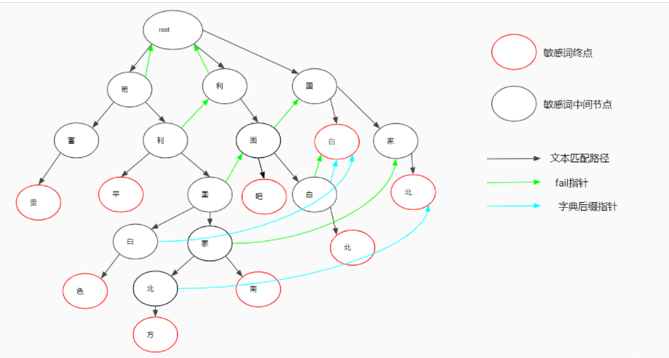
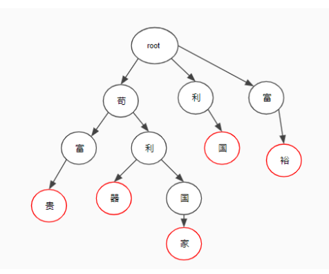
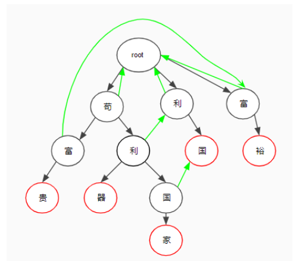
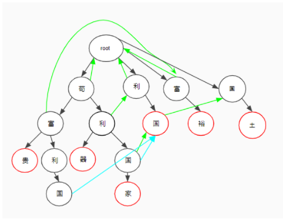

## 概述
 
Aho-Corasick automaton(后面心均以AC代替)，该算法在1975年产生于贝尔实验室，是著名的多模匹配算法之一。AC自动机算法分为3步：构造一棵Trie树，构造失效指针和模式匹配过程。而这3步就是AC自动机算法的精髓所在
 
学前导读
 
在学习本文之前，需要两个方面的知识背景。
Trie树（字典树）：维基百科
广度优先搜索：维基百科
 
## 案例
图中是由 ['苟富贵','苟利平','苟利国白色','苟利国家北方','苟利国家南','利国吧','利国白北','国白','国家北']几个敏感词组成的AC自动机

 
## 字典树的构造（Trie树）

如案例中所示，将每一个敏感词都改造成图中的树形结构，
其中：
1. 根节点为root节点
2. ‘苟利国家南’ 和 ‘苟利平’ 拥有共同的前缀节点 ‘苟利’，那么他们可以共享树 '苟' 和 '利' 的节点

 
 
## 构造指针
 
AC自动机中的指针主要有两种，Fail指针和字典后缀指针：
Fail指针主要负责应对当前节点下找不到想要的节点时情况：比如文本为苟富裕，苟富下没有裕，则需要依赖fail指针来让程序继续前进
字典后缀指针负责应对当前节点下有所想要的文本节点的情况：比如文本苟利国，苟利下有国，但苟利国不是敏感词，然而利国是敏感词，如果没有字典后缀指针，文本 ‘苟利国富‘ 将无法查出敏感词‘利国‘
 
构造Fail指针：
Fail指针用途为：
当我们在某个节点下无法找到文本对应的下一个文字，则去它的fail指针下找；
比如，如果被检验的文本为苟富裕，我们在苟富下无法找到裕，那么我们需要去富的Fail指针下寻找裕
 
Fail指针的构建原则是：
root的fail指针为它自己
root的子节点的fail指针为root
其他节点的fail指针为父指针的fail指针的子节点（比如苟利的利的fail指针为父节点（苟）的fail指针（root）的子节点利）
遍历所有树节点，为保证每个节点的fail指针比它先遍历，我们采用广度优先来遍历每个树节点
所以上图中的遍历顺序是：苟利富，富利国裕，贵器国，家
最终，我们可以遍历出每个节点的fail指针（如果存在），绿色指针：

 
构造字典后缀指针：
 
字典后缀指针的构建原则是：
当某个指针的fail指针指向是敏感词终点时，那么它的后缀指针就指向这个敏感词终点
当某个指针的fail指针指向有后缀指针时，那么它的后缀指针就指向它fail节点的后缀指针
否则，它的后缀指针为null
同样利用广度优先来遍历每个树节点，我们可以得到下图：

 
至此，我们的敏感词预处理已完成；等待接口请求文本进行匹配
 
## 匹配
 
匹配时，遍历被匹配文本，如果当前文字代表节点时敏感词终点节点，则返回改敏感词，匹配成功，文本校验不通过；
如果不是end节点，但是有后缀指针，则返回后缀指正所在敏感词，匹配成功，文本校验不通过；
如果既不是敏感词终点，且没有后缀指针，则继续匹配下一个文字，文本遍历指针无需返回